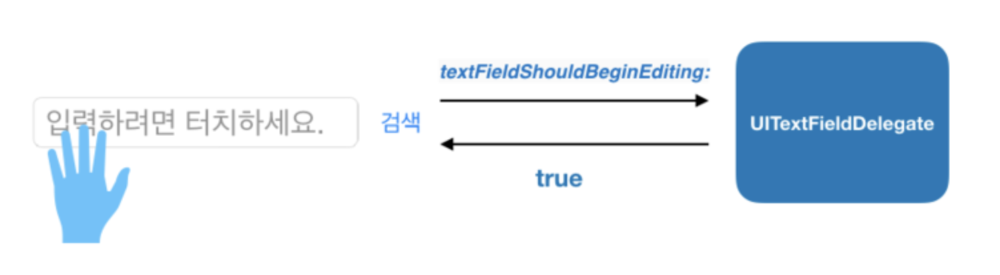

# Delegation

###### Delegate: [명사] 대표, 위임, 대리 [동사] (권한, 업무 등을) 위임하다


## Delegation Design Pattern
하나의 객체가 다른 객체르 ㄹ대신해 동작 또는 조정할 수 있는 기능을 제공
- Foundation, UIKit, AppKit, Cocoa Touch 등 애플의 프레임워크에서 광범위하게 활용
- 주로 프레임워크 객체가 위임을 요청하며, (주로 애플리케이션 프로그래머가 작성하는)커스텀 컨트롤러 객체가 위임을 받아 특정 이벤트에 대한 기능을 구현
- 커스텀 컨트롤러에서 세부 동작을 구현함으로써 동일한 동작에 대해 다양한 대응을 할 수 있게 해줌

#### ex) UITextFieldDelegate
```swift
// 대리자에게 특정 텍스트 필드의 문구를 편집해도 되는지 묻는 메서드
func textFieldShouldBeginEditing(UITextField)

// 대리자에게 특정 텍스트 필드의 문구가 편집되고 있음을 알리는 메서드
func textFieldDidBeginEditing(UITextField)

// 특정 텍스트 필드의 문구를 삭제하려고 할 때 대리자를 호출하는 메서드
func textFieldShouldClear(UITextField)

// 특정 텍스트 필드의 `Return` 키가 눌렸을 때 대리자를 호출하는 메서드
func textFieldShouldReturn(UITextField)
```




### DataSource
- 델리게이트와 매우 비슷한 역할
- 델리게이트가 사용자 인터페이스 제어에 관련된 권한을 위임받고, 데이터소스는 데이터를 제어하는 기능을 위임받음
- 많이 사용되는 데이터소스 : UITableViewDataSource, UICollectionViewDataSource


### Protocol
- 코코아터치에서 프로토콜을 사용해 델리게이션과 데이터소스를 구현
- 객체간 소통을 위한 강력한 통신 규약, 데이터나 메세지를 전달할 때 사용
- 특별한 상황에 대한 역할을 정의하고 제시하지만 세부 기능은 미리 구현해두지 않음
- 구조체, 클래스, 열거형에서 프로토콜을 채택하고 특정 기능을 수행하기 위한 요구 사항을 구현


#부스트코스 #iOS 프로그래밍
