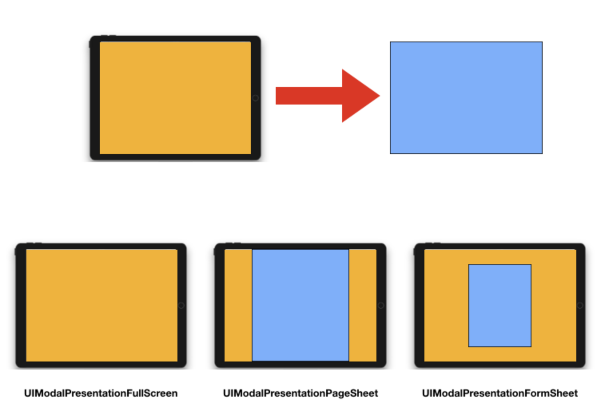
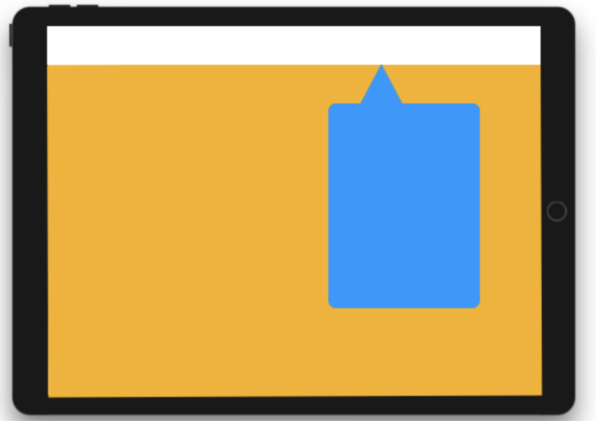
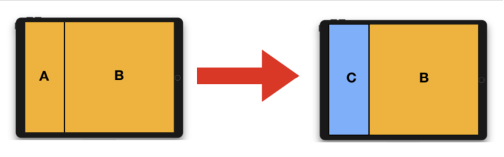
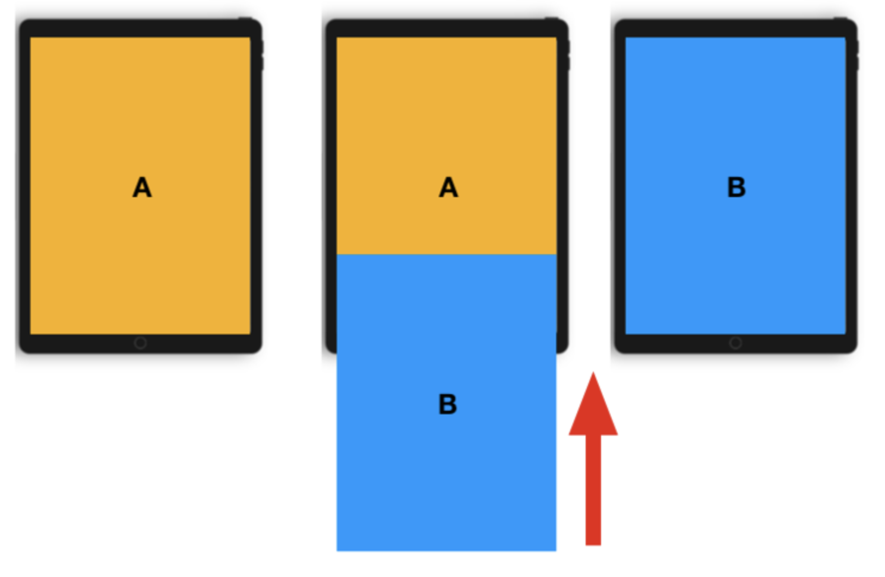

# Modal

## 모달
- 사용자의 이목을 끌기 위해 화면을 다른 화면 위로 띄워(Presenting) 표현하는 방식
- 단순하고 사용자가 빠르게 처리할 수 있는 내용을 표현하는 것이 좋음

- 네비게이션 인터페이스 - 정보의 흐름을 가지고 화면을 이동
- 모달 - 사용자의 이목을 끌어야하는 화면(팝업, 입력 폼 등)

## Present a View Controller
- 컨테이너 뷰 컨트롤러에 임베드 or 프레젠테이션 으로 화면 상에 나타냄
- present 기능은 UIViewController 클래스에 내장, 모든 뷰 컨트롤러에서 사용 가능
- 원래 뷰 컨트롤러 - 나타나는 뷰 컨트롤러 간 관계가 생성되어 나타나는 뷰 컨트롤러가 dismiss될 때 까지 유지

## The Presentation and Transition Process)
- 새로운 컨텐츠를 화면에 애니메이션으로 표시할 수 있는 쉽고 빠른 방법
- UIKit에 내장 된 프레젠테이션 기능은 내장 or 커스텀하여 새로운 뷰를 표시할 수 있도록 함
 
 ### Presentation Style
- Full-Screen Presentation Style
    - 화면 전체를 덮음
    - 아래 기본 컨텐츠와 상호작용 방지
    - 뷰를 흐리게하거나 투명도를 낮춰 기본 뷰 컨트롤러의 일부분을 보여줄 수도 있음
    
    
    
    > UIModelPresentationFullScreen 대신 UIModalPresentationOverFullScreen 스타일을 지정하여 아래의 뷰가 완전히 보이지 않는 것을 막을 수 있음

- The Popover Style
    - 추가 정보, 포커스(focused), 선택한 객체와 관련된 항목 목록을 표시하는데 유용
    - 팝업 뷰 외부에 탭을 하게되면 자동으로 팝업을 dismiss
    - iPad에서만 지원
    - [popover 프레젠테이션 구성 방법](https://developer.apple.com/library/archive/featuredarticles/ViewControllerPGforiPhoneOS/PresentingaViewController.html#//apple_ref/doc/uid/TP40007457-CH14-SW13)
    
    

- The Current Context Styles
    - 아래의 뷰 컨트롤러의 컨텐츠 영역에 컨텐츠를 올리는 형식
    - 프레젠테이션 중 사용할 전환 애니메이션 정의 가능

    


- Custom Presentation Styles
    - UIPresentationController를 상속받아 그 메서드를 사용해 커스텀 뷰를 화면상에 애니메이션으로 나타내고, 표시된 퓨 컨트롤러의 크기와 위치를 설정하는 것
    - [커스텀 프레젠테이션 생성하기](https://developer.apple.com/library/archive/featuredarticles/ViewControllerPGforiPhoneOS/DefiningCustomPresentations.html#//apple_ref/doc/uid/TP40007457-CH25-SW1)

### 전환 스타일(Transition Styles)
- 뷰 컨트롤러를 표시하는데 사용하는 애니메이션 유형을 결정
- 기본 전환 스타일 일 경우 - modalTransitionStyle 프로퍼티에 지정
- UIModalTransitionStyleCoverVertical - 뷰 컨트롤러를 화면 상에서 어떻게 애니메이션으로 나타내는지 알수 있음
- [전환 애니메이션 커스터마이징](https://developer.apple.com/library/archive/featuredarticles/ViewControllerPGforiPhoneOS/CustomizingtheTransitionAnimations.html#//apple_ref/doc/uid/TP40007457-CH16-SW1)

    


## Presenting Vs Showing a View Controller)
- showViewController:sender:, showDetailViewController:sender:  - 뷰 컨트롤러를 표시하는 데 가장 적응성이 우수하고 유연한 방법을 제공
- presentViewController:animated:completion: - 뷰 컨트롤러를 항상 모달 방식으로 표시

### Presenting a View Controller
 - [세그(Segue)](https://developer.apple.com/library/archive/featuredarticles/ViewControllerPGforiPhoneOS/UsingSegues.html#//apple_ref/doc/uid/TP40007457-CH15-SW1)를 사용해 인터페이스 빌더에서 지정한 정보를 사용하여 뷰 컨트롤러를 인스턴스화 하여 표시
 - showViewController:sender: , showDetailViewController:sender: 를 사용(ex) 커스텀 뷰 컨트롤러)
 - presentViewController:animated:completion: - 뷰 컨트롤러를 모달로 표시

### Showing View Controller
1. 나타나는 뷰 컨트롤러 객체를 만든 후 초기화
2. modalPresentationStyle 프로퍼티로 프레젠테이션 스타일 설정
3. modalTransitionStyle 프로퍼티로 전환 애니메이션 스타일 설정
4. 현재 뷰 컨트롤러의 showViewController:sender:,  showDetailViewController:sender: 호출

### Presenting View Controllers Modally
1. 나타나는 뷰 컨트롤러 객체를 만든 후 초기화
2. modalPresentationStyle 프로퍼티로 프레젠테이션 스타일 설정
3. modalTransitionStyle 프로퍼티로 전환 애니메이션 스타일 설정
4. 현재 뷰 컨트롤러의 presentViewController:animated:completion:  호출

### Presenting a View Controller in a Popover
- modalPresentationStyle을 UIModalPresentationPopover로 설정 
- preferredContentSize 프로퍼티로 원하는 크기 설정
- popoverPresentationController 프로퍼티에서 접근할수 있는 연관된 UIPopoverPresentation Controller 객체를 사용해 팝오버 고정 점을 설정 가능

> [UIPopoverPresentationController](https://developer.apple.com/documentation/uikit/uipopoverpresentationcontroller) 는 프로세스 중 발생하는 변경에 응답하는데 사용가능 한 delegate도 지원하기 때문에 필요에 따라 팝오버의 모양을 다른 방식으로 조정 가능하다.


## Dismissing a Presented View Controller
- dismiss(animated:completion:) 를 사용해 나타난 뷰 컨트롤러를 닫음
- 별도로 저장된 강한 참조가 없는 경우, 뷰 컨트롤러를 닫으면 연결된 뷰 컨트롤러가 메모리에서 해제됨


## Presenting a View Controller Defined in a Different Storyboard
- 하나의 스토리보드에 있는 뷰 컨트롤러 사이에는 세그를 생성할 수 있지만, 스토리보드 간 세그를 생성할 수 없음
```swift
let storyboard: UIStoryboard = UIStoryboard(name: "스토리보드 이름", bundle: nil)
if let vc: ViewController = storyboard.instantiateViewController(withIdentifier: "ViewController") as? ViewController {
    // 뷰 컨트롤러 구성
    
    // 뷰 컨트롤러를 나타냄
    self.present(vc, animated: true, completion: nil)
}
```

>  스토리보드가 여러개일 때 유용한 사례
    1. 대규모 프로그래밍 팀이 있고, 팀이 각기 다른 부분에 사용자 인터페이스의 서로 다른 부분이 할당된 경우, contention을 최소화 하기 위해 서로 다른 스토리보드 파일 내 사용자 인터페이스를 부분적으로 소유
    2. 뷰 컨트롤러 유형 컬렉션을 사전 정의하는 라이브러리를 사용하거나 생성하는 경우
    3. 외부화면에서 나타내야 하는 컨텐츠인 경우(커스텀 세그를 작성하는 방식도 있음)
