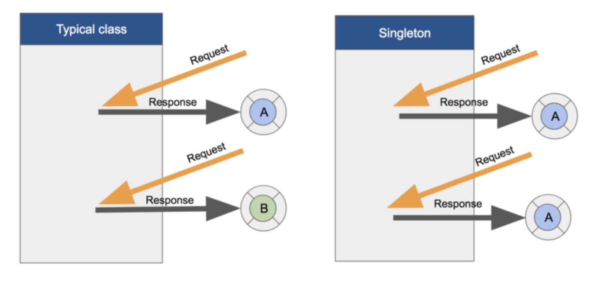

# Singleton

### Singleton
 - 특정 클래스의 인스턴스가 오직 하나임을 보장하는 객체
 - 애플리케이션 내에서 특정 클래스의 인스턴스가 딱 하나만 있기 때문에 다른 인스턴스들이 공유해서 사용할 수 있음
 
 

### Cocoa 프레임워크에서의 싱글턴 디자인 패턴
싱글턴 인스턴스를 반환하는 팩토리 메서드나 프로퍼티는 일반적으로 'shared'라는 이름을 사용

- [FileManager](https://developer.apple.com/documentation/foundation/filemanager)
    - 애플리케이션 파일 시스템을 관리하는 클래스
    - FileManager.default
- [URLSession](https://developer.apple.com/documentation/foundation/urlsession)
    - URL 세션을 관리하는 클래스
    - URLSession.shared
- [NotificationCenter](https://developer.apple.com/documentation/foundation/notificationcenter)
    - 등록된 알림의 정보를 사용할 수 있게 해주는 클래스
    - NotificaitonCenter.default
- [UserDefaults](https://developer.apple.com/documentation/foundation/userdefaults)
    - Key-Value 형태로 간단한 데이터를 저장하고 관리할 수 있는 인터페이스를 제공하는 DB클래스
    - UserDefault.standard
- [UIApplication](https://developer.apple.com/documentation/uikit/uiapplication)
    - iOS에서 실행되는 중앙제어 애플리케이션 객체
    - UIApplication.shared
    
    > 싱글턴 디자인 패턴은 애플리케이션 내의 특정 클래스의 인스턴스가 하나만 존재하기 때문에 객체가 불필요하게 여러 개 만들어질 필요가 없는 경우에 많이 사용한다. ex) 환경설정, 네트워크 연결처리, 데이터 관리 등 / 멀티스레드 환경에서 동시에 싱글턴 객체를 참조할 경우 원치 않은 결과가 가져올 수 있더니 고려해서 활용하도록 하자!
