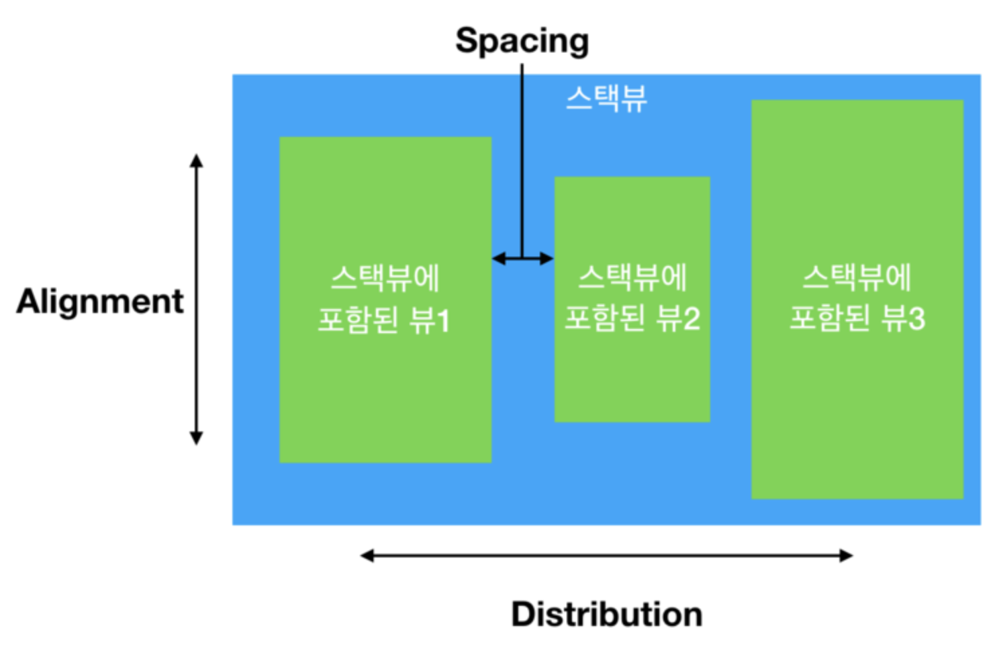

# StackView

## UIStackView
- 여러 뷰들의 수평 또는 수직 방향의 선형적인 레이아웃의 인터페이스를 사용할 수 있도록 해줌
- axis, distribution, alignment, spacing 같은 프로퍼티를 통해 조정

### arrangedSubviews
 스택뷰에 포함된 뷰들을 관리, 스택뷰에 포함된 뷰의 순서가 레이아웃에 영향을 미침

### 스택뷰의 생성
#### 스택뷰를 먼저 생성하고 그 안에 새로운 뷰를 추가하기
1. 스토리보드의 객체 라이브러리에서 스택뷰를 캔버스에 추가
2. 객체 라이브러리에서 버튼이나 라벨을 생성된 스택뷰에 추가
3. 다른 버튼이나 라벨을 스택뷰에 추가
4. 속성 인스펙터의 spacing 에서 간격입력

#### 이미 존재하는 뷰들을 스택뷰에 추가하는 방법
1. 스토리보드에서 객체 라이브러리로 버튼이나 라벨 두개 추가
2. 추가한 것을 선택 후 메뉴 바의 Editor > Embed In > Stack View 하거나 캔버스 하단의 Embed In Stack 버튼 클릭 

### UIStackView 클래스 주요 프로퍼티
- var arrangedSubviews: [UIView] - 스택뷰의 정렬된 뷰의 배열. 스택뷰에 포함된 뷰들을 여기에 저장하고 관리
- var axis : UILayoutConstraintAxis: 레이아웃의 방향 결정(vertical - 수직, horizontal - 수평)
- var distribution: UIStackViewdistribution - 스택뷰에 포함된 뷰가 스택뷰 내에서 어떻게 배치(분배)될지 결정
- var spacing: CGFloat - 스택뷰에 정렬된 뷰 사이의 간격을 결정, default - 0.0
### UIStackView 클래스 주요 메서드
- func addArrangeSubview(UIView) - arrangedSubviews 배열에 마지막 요소에 뷰를 추가
- func insertArrangedSubview(UIView, at: Int) - arrangedSubview 배열의 특정 인덱스에 뷰 추가
- func removeArrangedSubview(UIView) - 스택뷰의 arrangedSubviews 배열로부터 뷰를 제거

#부스트코스 #iOS 프로그래밍
