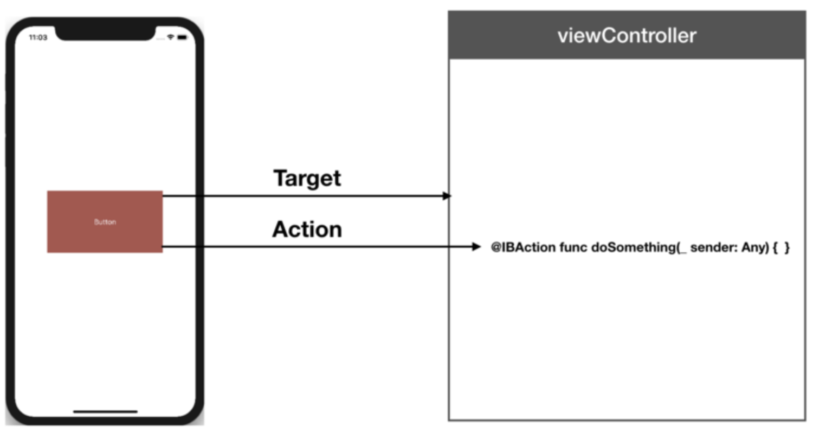

# Target-Action


### Target-Action 디자인 패턴
Target-Action 디자인 패턴은 iOS 환경에서 많이 사용하는 디자인 패턴 중 하나
- 객체 - 이벤트가 발생할 때 다른 객체에 메시지를 보내는 데 필요한 정보를 포함
- 액션 - 특정 이벤트가 발생했을 때 호출할 메서드, 프레임워크 객체를 포함한 모든 객체가 될 수 있으나, 일반적으로는 컨트롤러
- 타겟 - 액션이 호출될 객체
- 액션 메시지 - 이벤트 발생 시 전송된 메시지

> 같은 메서드가 여러 클래스에 정의되어 있는 경우, 클래스의 인스턴스가 여러 개인 상황에서 우너하는 객체를 Target으로 지정하면 액션을 실행할 객체를 상황에 따라 선택할 수 있다.





### 액션 메서드
```swift
// 프로그래밍 방식
@objc func doSomething(_ sender: Any) {

}

// 인터페이스 빌더
@IBAction func doSomething(_ sender: Any) {

}
```

- IBAcation은 인터페이스 빌더가 메서드를 인지할 수 있도록 해줌
- @objc 는 Swift 클래스를 사용하는 Objective-C 유형의 메서드나 코드를 쓰는 경우 필요 


> 스위프트 4이전의 컴파일러는 @objc를 자동으로 만들어 주었지만, 자원 비용이 많이 들어 스위프트 4에서는 명시적으로 작성


### 컨트롤 이벤트
#### 컨트롤 이벤트와 액션과의 관계
- 컨트롤 객체(UIKit에 있는 UIButton, UISwitch, UIStepper 등 UIControl을 상속받은 다양한 컨트롤 클래스)에 발생하면, 미리 지정해둔 타켓의 액션을 호출

#### 컨트롤 이벤트의 종류
> 컨트롤 이벤트는 UIControlEvents 라는 타입으로 정의되어 있음
- touchDown
    - 컨트롤을 터치했을 때 발생하는 이벤트
    - UIControlEvents.touchDown
- touchDownRepeat
    - 컨트롤을 연속 터치할 때 발생하는 이벤트
    -  UIControlEvents.touchDownRepeat
- touchDragInside
    - 컨트롤 범위 내에서 터치한 영역을 드래그 할 때 발생하는 이벤트
    - UIControlEvents.touchDragInside
- touchOutside
    - 터치 영역이 컨트롤의 바깥쪽에서 드래그 할 때 발생하는 이벤트
    - UIControlEvents.touchDragOutside
- touchDragEnter
    - 터치 영역이 컨트롤의 일정 영역 바깥쪽으로 나갔다가 다시 들어왔을 때 발생하는 이벤트
    - UIControlEvents.touchDragEnter
- touchDragExit
    - 터치 영역이 컨트롤의 일정 영역 바깥쪽으로 나갔을 때 발생하는 이벤트
    - UIControlEvents.touchDragExit
- touchUpInside
    - 컨트롤 영역 안쪽에서 터치 후 뗐을 때 발생하는 이벤트
    - UIControlEvents.touchUpInside
- touchUpOutside
    - 컨트롤 영역 안쪽에서 터치 후 컨트롤 밖에서 뗐을 때 이벤트
    - UIControlEvents.touchUpOutside
- touchCancel
    - 터치를 취소하는 이벤트로 touchUp 이벤트가 발생되지 않음
    - UIControlEvents.touchCancel
- valueChanged
    - 터치를 드래그 및 다른 방법으로 조작하면 값이 변경되었을 때 발생하는 이벤트
    - UIControlEvents.valueChanged
- primaryActionTriggered
    - 버튼이 눌릴 때 발생하는 이벤트(iOS보다 tvOS에서 사용)
    - UIControlEvents.primaryAcionTriggered
- editingDidBegin
    - UITextField에서 편집이 시작될 때 호출되는 이벤트
    - UIControlEvents.editingDidBegin
- editingChanged
    - UITextField에서 값이 바뀔 때 마다 호출되는 이벤트
    - UIControlEvents.editingChanged
- editingDidEnd
    - UITextField에서 외부 객체와의 상호작용으로 인해 편집이 종료되었을 때 발생하는 이벤트
    - UIControlEvents.editingDidEnd
- editingDidEndOnExit
    - UITextField의 편집상태에서 키보드의 return 키를 터치 했을 때 발생하는 이벤트
    - UIControlEvents.editingDidEndOnExit
- allTouchEvents
    - 모든 터치 이벤트
    - UIControlEvents.allTouchEvents
- allEditingEvents
    - UITextField에서 편집 작업의 이벤트
    - UIControlEvents.allEditingEvents
- applicationReserved
    - 각각의 애플리케이션에서 프로그래머가 임의로 지정할 수 있는 이벤트 값의 범위
    - UIControlEvents.applicationReserved
- systemReserved
    - 프레임워크 내에서 사용하는 예약된 이벤트 값의 범위
    - UIControlEvents.systemReserved
- allEvents
    - 시스템 이벤트를 포함한 모든 이벤트
    - UIControlEvents.allEvents


#부스트코스 #iOS 프로그래밍
