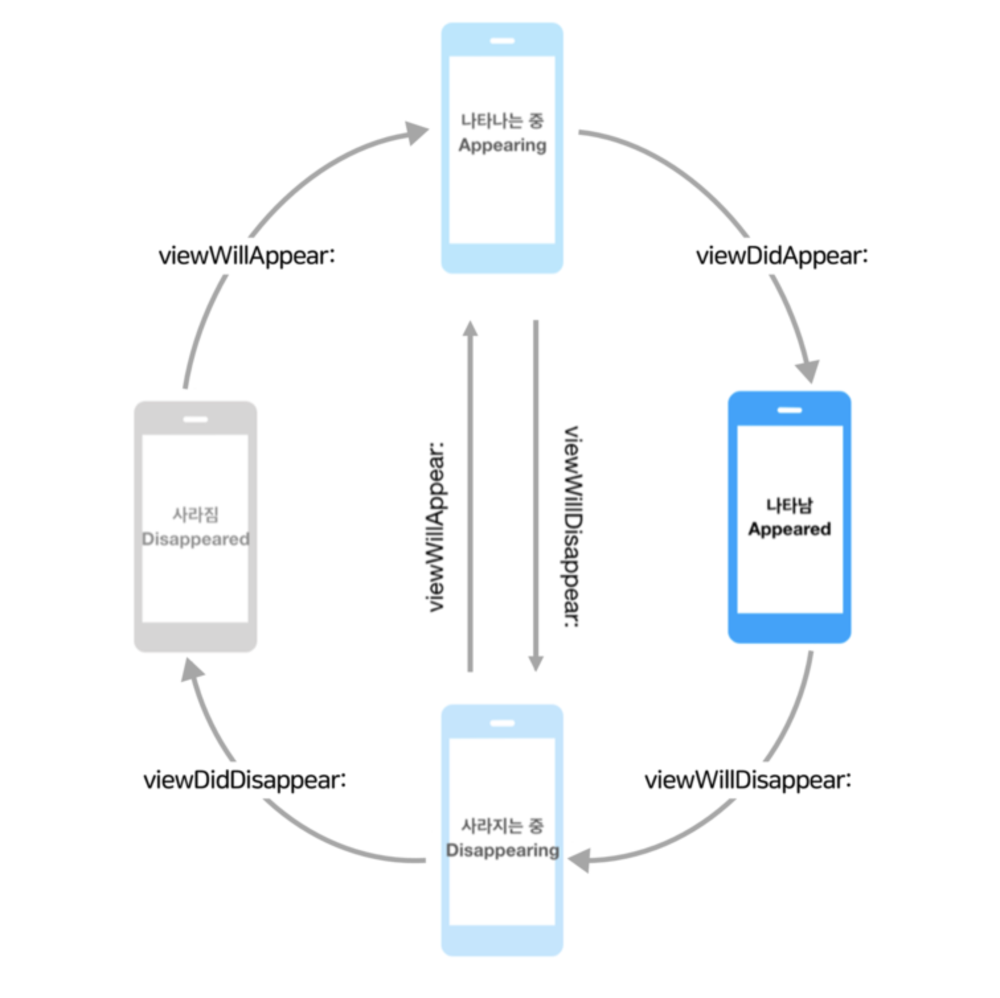

# 뷰의 상태변화 감지 메서드




## 뷰의 상태변화 메서드
  뷰가 나타나거나 사라지는 등 뷰가 화면에서 보이는 상태가 변화할 때 호출되는 메서드
 
 - func viewDidLoad()
    - 뷰 계층이 메모리에 로드된 직후 호출되는 메서드
    - 뷰의 추가적인 초기화 작업을 하기 좋은 시점
    - 메모리에 처음 로딩될 때 1회 호출, 메모리 경고로 뷰가 사라지지 않는 이상 다시 호출되지 않음
- func viewWillAppear(_ animated: Bool)
    - 뷰가 뷰 계층에 추가되고 화면이 표시되기 직전에 호출되는 메서드
    - 뷰의 추가적인 초기화 작업을 하기 좋은 시점
    - 다른 뷰로 이동했다가 되돌아오면 재호출되는 메서드로, 화면이 나타날 때마다 수행해야하는 작업을 하기 좋음
- func viewDidAppear(_ animated: Bool)
    - 뷰가 뷰 계층에 추가되어 화면이 표시되면 호출되는 메서드 
    - 뷰를 나타내는 것과 관련된 추가적인 작업을 하기 좋은 시점
- func viewWillDisappear(_ animated: Bool)
    - 뷰가 뷰 계층에서 사라지기 직전에 호출되는 메서드
    - 뷰가 생성된 뒤 발생하는 변화를 이전상태로 되돌리기 좋은 시점
- func viewDidDisappear(_ animated: Bool)
    - 뷰가 뷰 계층에서 사라진 후 호출되는 메서드
    - 뷰를 숨기는 것과 관련된 추가적인 작업을 하기 좋은 시점
    - 시간이 오래 걸리는 작업은 하지 않는 것이 좋음
 

## 뷰의 레이아웃 변화 메서드
  뷰가 생성된 후 바운드 및 위치 등의 레이아웃에 변화가 발생했을 때 호출되는 메서드
  
- func viewWillLayoutSubviews()
    - 뷰가 서브뷰의 레이아웃을 변경하기 직전에 호출되는 메서드
    - 서브 뷰의 레이아웃을 변경하기 전에 수행할 작업을 하기 좋은 시점
- func viewDidLayoutSubviews()
    - 서브뷰의 레이아웃이 변경된 후 호출되는 메서드
    - 서브뷰의 레이아웃을 변경한 후 추가적인 작업을 수행하기 좋은 시점
    
[Configuring the View's Layout Behavior 참고](https://developer.apple.com/documentation/uikit/uiviewcontroller)

> 뷰 컨트롤러에서 메서드를 사용하기 전에 override 키워드 명시 후 super 호출하기!!
```swift
override func viewDidLoad() {
    super.viewDidLoad()
    
}
```


